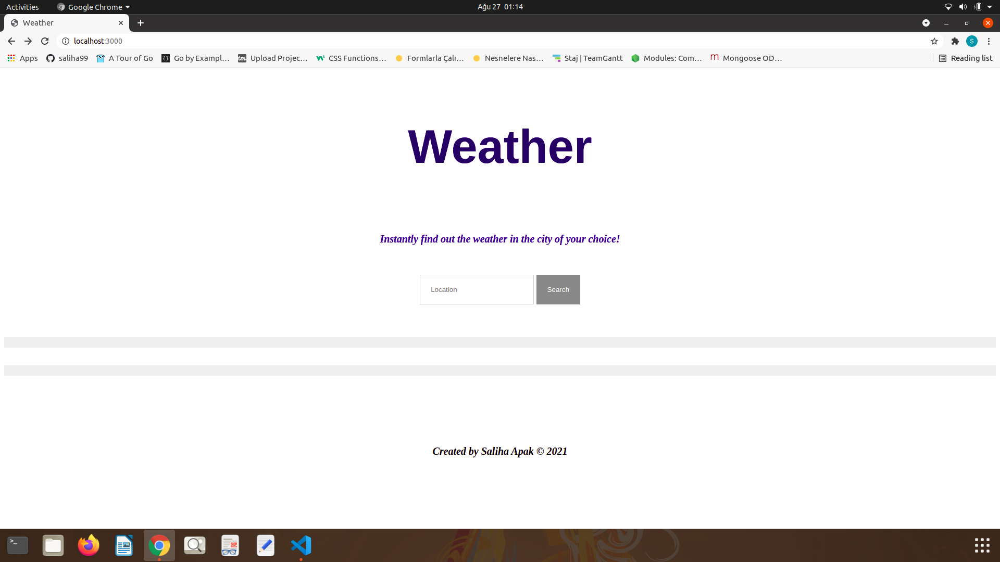
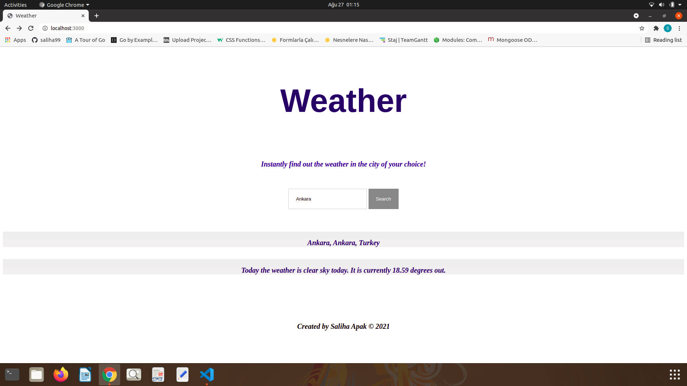

# Weather Application 

My first nodejs project.


```
In the search button, we write the name of the city we want to know the instant weather forecast.
```



```
After clicking the "Search" button, the results are displayed on our screen as seen.
```


